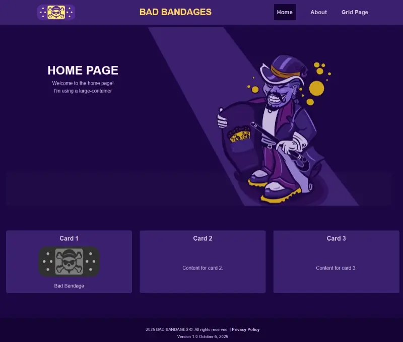

---
<figure class="image"></figure>

Bad Bandages is my simple HTML and CSS framework for testing or creating
ridiculous simple static web pages.

## Installation

Create a **named project folder** on your desktop or somewhere else and open it
up with a terminal. Download this repo last or set it aside.

Use a package manager to install
[Vite](https://vite.dev/guide/#scaffolding-your-first-vite-project).

```sh
# I use Deno:
deno init --npm vite .

# Or npm:
npm create vite@latest .
```

1. Choose Vanilla as a Framework and as rolldown instead of rollup.

2. Vanilla JavaScript

3. deno install

4. deno run dev

5. If you see the logos you're good to go. Now in the project folder delete the
   following:

- public folder

- src folder

- index.html

6. Download this repo. Copy or replace this repo's folders, index.html,
   index.js, vite.config.js and the home.css file inside your project.

```plain
// It should look like this:

| about - folder
| bandages - folder
| public - folder
| package.json or deno.json
| index.html
| LICENSE
| preview.webp
| README.md
| vite.config.js
| deno.jsonc
| src - folder
| node_modules - folder
```

Read more about Multi-Page App
[Vite Config](https://vite.dev/guide/build.html#multi-page-app)
---

## Optional Plugins

Simple HTML Minify plugin to minify HTML during the build:

```bash
deno add -D npm:vite-plugin-simple-html
# Or:
npm install vite-plugin-simple-html
```

Import the plugin:

```js
//vite.config.js

import simpleHtmlPlugin from "vite-plugin-simple-html";
```

Add it to your vite.config.js file, plugin's array:

Check the
[vite-plugin-simple-html](https://github.com/wojtekmaj/vite-plugin-simple-html "GitHub Plugin Page")
plugin for more info and options.

```js
// vite.config.js

  plugins: [
    simpleHtmlPlugin({
      minify: true,
    }),
  ],
```

And your done…

```sh
deno task dev
# Or:
npm run dev
```

## License

[MIT](https://choosealicense.com/licenses/mit/)
