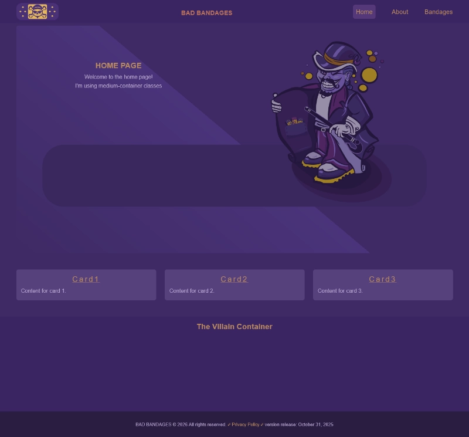

---
<figure class="image"></figure>

Bad Bandages is my simple HTML and CSS framework for testing or creating
ridiculous simple static web pages.

## Installation

Create a **named project folder** on your desktop or somewhere else and open it
up with a terminal. Download this repo last or set it aside.

Use a package manager to install [Vite](https://vite.dev/guide/#scaffolding-your-first-vite-project).

```sh
# Install Vite with Deno:
deno init --npm vite

# Or pnpm:
pnpm create vite
```

1. Choose Vanilla.

2. Vanilla JavaScript

3. deno install

4. deno run dev (deno task dev)

5. If you see the logos you're good to go. Now in the project folder delete the
   following:
- public folder

- src folder

- index.html
6. Download this repo. Copy or replace this repo's folders, index.html,
   index.js, vite.config.js  and the home.css file inside your project.

---

And your done…

```sh
deno task dev
# Or:
(p)npm run dev
```

## License

[MIT](https://choosealicense.com/licenses/mit/)
